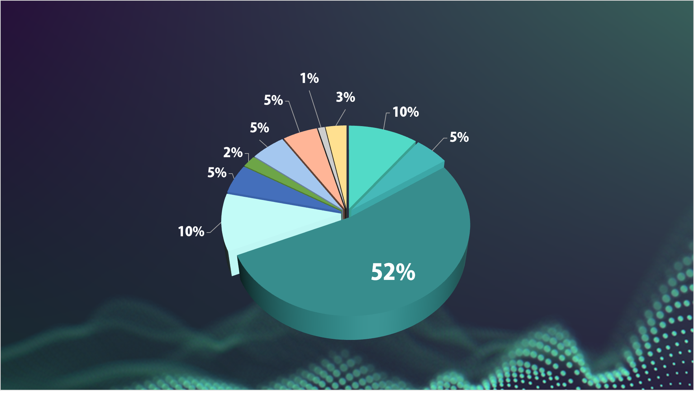

# Distribution plan

Leopard  is a governance token based on the Leopard ecosystem released by BINANCE SMART CHAIN. It will be circulated in various applications of the Leopard DAO ecosystem. If you hold the Leopard token, you can participate in the governance voting of the ecosystem. Enjoy ecological dividends. The Leopard DAO ecosystem will gradually integrate major communities around the world to jointly create the world's most valuable community self-governance ecological mechanisms and concepts.

&#x20;

⭐️ Name: **leopard token**&#x20;

⭐️ Circulation **1,000,000,0000**

⭐️ Initial value **$35,633,771**&#x20;

⭐️ Exchange: **300U = 3 million leopard**

Issuing public chain: **BINANCE SMART CHAIN**

Trading Platform:  **PLS2ESwap**

&#x20;

Leopard Distribution Mechanism Angel investors and INOs: 10% (After 3 years. Released in the cycle phase. Released 0.5% every 180 days. It takes 13 years to release)

Liquidity: 5%

Transaction ecology: 52%

Brokerage agent: 10% (50% will be released online. The second 50% will be released in a one-year cycle. )

DAO: 5%

Airdrop: 2%

Marketing: 5%

Partner: 5% (After 2 years. Released in cycle phase. Released 0.5% every 180 days. Released in 7 years.)

Foundation: 1%

Trading Team: 3% (After 1 year. Released in cycle phase. Released 0.5% every 180 days. Released in 4 years. )

