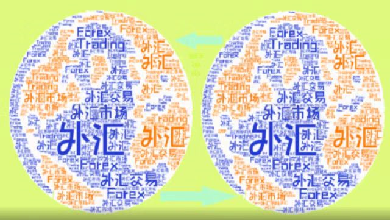

# Leopard DAO

**Leopard** DAO is a decentralized autonomous organization composed of community members from all over the world. In the future, it will provide decision-making suggestions for the development of the **Leopard** ecology, so as to establish a healthy autonomous organization that can share and prosper with all members. and common development. Users become voting members of the **Leopard** DAO by purchasing **Leopard** TOKEN, and over time, the community will be decentralized through the management of the DAO.

